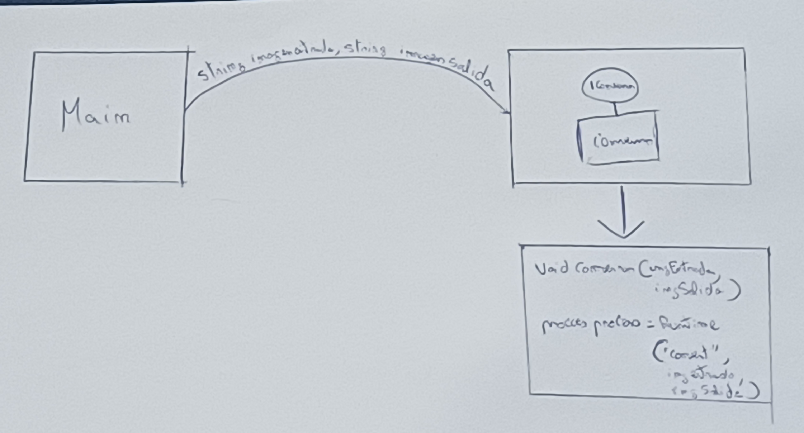

# PRACTICA IMAGENES
## INDICE
- [Diseño](#diseño)
- [Conversion](#conversion)
  - [IConversor.java](#iconversorjava)
  - [Conversor.java](#conversorjava)
- [Main.java](#mainjava)
- [Testing](#testing)
  - [testIntegridadImagenConvertida()](#testintegridadimagenconvertida)
  - [testFormatoNoValido()](#testformatonovalido)
  - [testArchivoNoExiste()](#testarchivonoexiste)

## Diseño
<p>

</p>

En el diseño tengo 1 clase **Main** y un paquete que llamo **conversion**, dentro del paquete conversor tengo una clase y una interfaz , la clase se llama **Conversor.java** y la interfaz es **IConversor.java**.
funciona de la siguiente manera:
1. Desde el **Main** le pasare la ruta de dos imagenes **(la ruta de imagenentrada y la ruta de imagensaldia)**, a la clase conversor.java,

2. La clase Conversor.java que esta dentro del paquete conversion, tiene implentada la interfaz IConversor.java. La clase Conversor.java recibe las rutas de las dos imagenes y ejecutamos el comando **convert** con las dos imagenes y si todo es correcto, el comando generará la imagen con el formato que hemos indicado en imagensalida.

## Conversion
Conversion es un paquetes que contiene:
- **IConversor.java:** Es una interfaz que define un método para convertir una imagen a otro formato y manejar posibles errores o interrupciones.
- **Conversor.java**: Es una clase que implementa IConversor y convierte imágenes usando el comando del sistema convert.

### IConversor.java
```java
public interface IConversor {
    void convertirImagen(String imagenentrada, String imagensalida) throws IOException, InterruptedException;
}
```
La interfaz **IConversor** sirve como modelo para clases que convierten imágenes.
Cualquier clase que la implemente debe tener un método ``convertirImagen()``que reciba una imagen de entrada que es la que ya tenemos creada y una imagen salida que es la imagen con el nuevo formato.

### Conversor.java
```java
public class Conversor implements IConversor {

    @Override
    public void convertirImagen(String imagenentrada, String imagensalida) throws IOException, InterruptedException {
        List<String> formatosValidos = List.of("jpg", "png", "gif", "bmp");
        String formatonovalido;
        String archivonoencontrado;
        String extension = imagensalida.substring(imagensalida.lastIndexOf('.') + 1).toLowerCase();


        if (!formatosValidos.contains(extension)) {
            formatonovalido="Formato no válido: " + extension +
                    ". Formatos permitidos: " + String.join(", ", formatosValidos);

            throw new IOException(formatonovalido);
        }

        File archivoEntrada = new File(imagenentrada);
        if (!archivoEntrada.exists()) {
            archivonoencontrado="Archivo de entrada no encontrado: " + imagenentrada;

            throw new IOException(archivonoencontrado);
        }

        String[] comando = { "convert", imagenentrada, imagensalida };

        try {
            Process proceso = Runtime.getRuntime().exec(comando);
            proceso.waitFor();
        } catch (IOException | InterruptedException e) {
            System.err.println(e.getMessage());
        }
    }
}
```

Este código define una clase llamada Conversor, la cual implementa la interfaz IConversor. Su función principal es convertir una imagen de un formato a otro utilizando el comando externo convert.
Dentro de la clase tenemos el método ``convertirImagen()``, que nos pide una imagen de entrada y una imagen de salida que sera la imagen con el formato nuevo, para ello primero definimos una lista con los formatos a los qu permitiremos elegir.

```java
List<String> formatosValidos = List.of("jpg", "png", "gif", "bmp");
```
Una vez definida la lista sacamos la extensión del archivo de salida a partir de su nombre y se convierte a minúsculas., esto lo hago para después comprobar si la extension del archivo esta dentro de la lista. 

```java
String extension = imagensalida.substring(imagensalida.lastIndexOf('.') + 1).toLowerCase();
```

Una vez scada la extension de imagensalida se verifica si la extensión de salida está dentro de ellos; si no lo está, se lanza una excepción indicando que el formato no es válido.
```java
if (!formatosValidos.contains(extension)) {
    formatonovalido="Formato no válido: " + extension +
    ". Formatos permitidos: " + String.join(", ", formatosValidos);

    throw new IOException(formatonovalido);
}
```
Después, se crea un objeto File con la ruta del archivo de entrada y se comprueba si realmente existe; en caso contrario, se lanza otra excepción informando que el archivo no fue encontrado.
```java
File archivoEntrada = new File(imagenentrada);
    if (!archivoEntrada.exists()) {
        archivonoencontrado="Archivo de entrada no encontrado: " + imagenentrada;

            throw new IOException(archivonoencontrado);
    }

```
Una vez superadas las validaciones, se prepara un array con le comando convert y los dos imagenes **(imagenentrada,imagensalida)** y se lanza ese proceso
```java
String[] comando = { "convert", imagenentrada, imagensalida };

        try {
            Process proceso = Runtime.getRuntime().exec(comando);
            proceso.waitFor();
        } catch (IOException | InterruptedException e) {
            throw new IOException(e.getMessage());
        }
```

El programa espera a que termine el proceso usando ``waitFor()``, y si ocurre algún error durante la ejecución, lo captura y muestra el mensaje en la consola de error.

## Main.java
```java
public class Main {
    public static void main(String[] args) throws IOException, InterruptedException {
        Conversor conversor = new Conversor();
        String usoformato = "Uso: java com.example.Programa <imagen_entrada> <imagen_salida>";
        if (args.length != 2) {
            throw new IOException(usoformato);
        }
        String imagenentrada = args[0];
        String imagensalida = args[1];
        try {
        conversor.convertirImagen(imagenentrada, imagensalida);
         } catch (IOException | InterruptedException e) {
            throw new IOException(e.getMessage());
        }
    }
}
```
La clase **Main** contiene el método principal main, Dentro empiezo creando un objeto de la clase **Conversor**, que utilizare para realizar la conversión de imágenes.


Primero, comprueba si el usuario ha proporcionado exactamente dos argumentos en la línea de comandos: el nombre del archivo de entrada y el nombre del archivo de salida. Si no se cumplen estas condiciones, se muestra el mensaje de uso en la salida de error.
```java
 String usoformato = "Uso: java com.example.Programa <imagen_entrada> <imagen_salida>";
        if (args.length != 2) {
            throw new IOException(usoformato);
        }
```
Si los argumentos son correctos, se guardan en las variables imagenentrada y imagensalida. 

A continuación, el programa intenta realizar la conversión llamando al método convertirImagen del objeto conversor, pasando como parámetros los nombres de los archivos.

```java
try {
        conversor.convertirImagen(imagenentrada, imagensalida);
         } catch (IOException | InterruptedException e) {
            throw new IOException(e.getMessage());
        }
```

Si durante la conversión ocurre algún problema:
- **como que el archivo de entrada no exista, el formato de salida no sea válido o falle la ejecución del comando convert**, la excepción se captura en el bloque catch. En ese caso, se imprime el mensaje de error correspondiente en la consola y se finaliza el programa, indicando un fallo durante la conversión.

## TESTING

### ``testIntegridadImagenConvertida()``

```java
@Test
void testIntegridadImagenConvertida() throws IOException, InterruptedException {
    String imagenentrada = "src/main/java/com/example/IconoJava.png";
    String imagensalida = "src/main/java/com/example/IconoJava.jpg";

    File archivoSalida = new File(imagensalida);
    if (archivoSalida.exists()) archivoSalida.delete();

    conversor.convertirImagen(imagenentrada, imagensalida);

    assertAll("Verificación de imagen convertida",
        () -> assertTrue(archivoSalida.exists(), "La imagen convertida no fue creada"),
        () -> assertEquals("IconoJava.jpg", archivoSalida.getName(), "El nombre del archivo no es el esperado")
    );
}

```

Este test verifica que la conversión de una imagen se realice correctamente y que el archivo resultante exista.
Primero se define una imagen de entrada **(IconoJava.png)** y una de salida **(IconoJava.jpg)**. Si el archivo de salida ya existe, se elimina para asegurar que la prueba empiece limpia. Luego se llama al método ``convertirImagen()`` de la clase conversor.
Después de la conversión, se agrupan varias verificaciones con **assertAll**:

- Que el archivo de salida realmente exista.

- Que el nombre del archivo convertido sea exactamente el esperado.
```java
assertAll("Verificación de imagen convertida",
        () -> assertTrue(archivoSalida.exists(), "La imagen convertida no fue creada"),
        () -> assertEquals("IconoJava.jpg", archivoSalida.getName(), "El nombre del archivo no es el esperado")
    );
```

### ``testFormatoNoValido()``

```java
@Test
void testFormatoNoValido() {
    String imagenentrada = "src/main/java/com/example/IconoJava.png";
    String imagensalida = "salida.md"; 

    IOException e = assertThrows(IOException.class, () -> {
        conversor.convertirImagen(imagenentrada, imagensalida);
    });

    assertTrue(e.getMessage().toLowerCase().contains("formato no válido"));
}
```

Esta prueba evalúa el comportamiento del conversor cuando se intenta convertir una imagen a un formato no permitido.
Se usa como archivo de salida **"salida.md"**, cuya extensión .md no está en la lista de formatos válidos **(solo se aceptan jpg, png, gif y bmp)**.
```java
IOException e = assertThrows(IOException.class, () -> {
        conversor.convertirImagen(imagenentrada, imagensalida);
    });

assertTrue(e.getMessage().toLowerCase().contains("formato no válido"));
```
El método **assertThrows** comprueba que el método ``convertirImagen()`` lance una excepción del tipo IOException.
Luego, se verifica que el mensaje del error contenga la frase “formato no válido”, confirmando que el programa identifica correctamente los formatos no admitidos y responde con un mensaje apropiado.

### ``testArchivoNoExiste()``
```java
@Test
void testArchivoNoExiste() {
    String imagenentrada = "src/main/java/com/example/NoExiste.png";
    String imagensalida = "src/main/java/com/example/NoExiste.jpg";

    // Solo comprobamos que se lance IOException
    assertThrows(IOException.class, () -> {
        conversor.convertirImagen(imagenentrada, imagensalida);
    });
}
```

En esta prueba se comprueba que el programa maneje adecuadamente el caso en que el archivo de entrada no existe.
Se proporciona una ruta de imagen inexistente (NoExiste.png) y su archivo de salida correspondiente (NoExiste.jpg).
El test usa **assertThrows** para comprobar que al intentar convertir un archivo inexistente se lanza una excepción IOException.
Con esto se valida que el método ``convertirImagen()`` detecta correctamente cuando el archivo de entrada no está disponible y no intenta ejecutar la conversión.

## [Enlace Reposito](https://github.com/ManuelPavonBuendia/EjercicioImagenes.git)